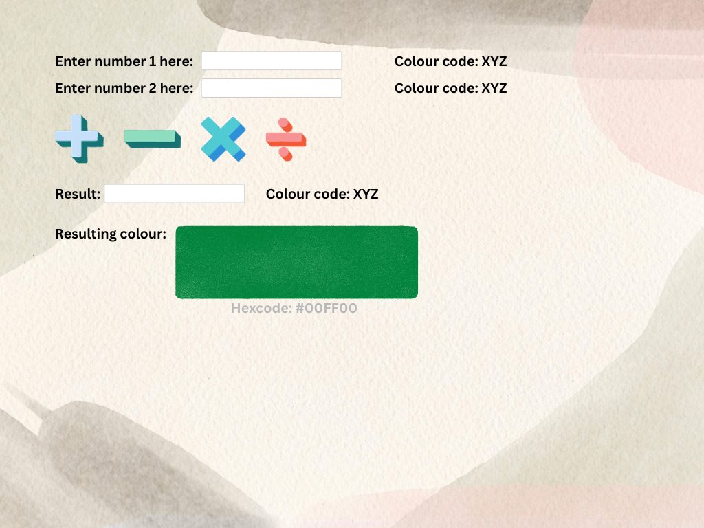

# Project ideation:
- Main idea: Binary calculator with conversion and fun colour integration:
- Feature 1: Project will involve a fully-functioning binary calculator. Operations will include addition, subtraction, multiplication, division, and hexadecimal/decimal conversion
- Binary addition is done using 1's and 2's complements.
    ```
    <head>
        <meta charset="UTF-8">
        <meta name="viewport" content="width=device-width, initial-scale=1.0">
        <title>Binary Addition</title>
    </head>
    <body>
        <h2>Binary Addition</h2>
        <label for="binaryInput1">Binary Number 1: </label>
        <input type="text" id="binaryInput1" placeholder="Enter binary number">
        <br>
        <label for="binaryInput2">Binary Number 2: </label>
        <input type="text" id="binaryInput2" placeholder="Enter binary number">
        <br>
        <button onclick="addBinaryNumbers()">Add</button>
        <br>
        <label for="result">Result: </label>
        <span id="result"></span>

        <script>
            function addBinaryNumbers() {
                // Get user input
                const binaryInput1 = document.getElementById('binaryInput1').value;
                const binaryInput2 = document.getElementById('binaryInput2').value;

                // Validate binary inputs
                if (!isValidBinary(binaryInput1) || !isValidBinary(binaryInput2)) {
                    alert('Please enter valid binary numbers (0 or 1 only)');
                    return;
                }

                // Pad binary strings to the same length
                const maxLength = Math.max(binaryInput1.length, binaryInput2.length);
                const paddedBinary1 = binaryInput1.padStart(maxLength, '0');
                const paddedBinary2 = binaryInput2.padStart(maxLength, '0');

                // Perform bitwise addition using 1's complement and 2's complement
                const sum = addBinary(paddedBinary1, paddedBinary2);

                // Display the result
                document.getElementById('result').textContent = sum;
            }

            function addBinary(binary1, binary2) {
                let carry = 0;
                let result = '';

                for (let i = binary1.length - 1; i >= 0; i--) {
                    const bit1 = parseInt(binary1[i]);
                    const bit2 = parseInt(binary2[i]);

                    const sum = bit1 + bit2 + carry;
                    result = (sum % 2) + result;
                    carry = sum >= 2 ? 1 : 0;
                }

                if (carry === 1) {
                    result = '1' + result;
                }

                return result;
            }

            function isValidBinary(binaryString) {
                // Check if the string consists only of '0' and '1' characters
                return /^[01]+$/.test(binaryString);
            }
        </script>
    </body>
    </html>
    ```
- Binary subtraction is done using 1's and 2's complements as well.
    ```
    <head>
        <meta charset="UTF-8">
        <meta name="viewport" content="width=device-width, initial-scale=1.0">
        <title>Binary Subtraction</title>
    </head>
    <body>
        <h2>Binary Subtraction</h2>
        <label for="binaryInput1">Binary Minuend: </label>
        <input type="text" id="binaryInput1" placeholder="Enter binary number">
        <br>
        <label for="binaryInput2">Binary Subtrahend: </label>
        <input type="text" id="binaryInput2" placeholder="Enter binary number">
        <br>
        <button onclick="subtractBinaryNumbers()">Subtract</button>
        <br>
        <label for="result">Result: </label>
        <span id="result"></span>

        <script>
            function subtractBinaryNumbers() {
                // Get user input
                const binaryInput1 = document.getElementById('binaryInput1').value;
                const binaryInput2 = document.getElementById('binaryInput2').value;

                // Validate binary inputs
                if (!isValidBinary(binaryInput1) || !isValidBinary(binaryInput2)) {
                    alert('Please enter valid binary numbers (0 or 1 only)');
                    return;
                }

                // Pad binary strings to the same length
                const maxLength = Math.max(binaryInput1.length, binaryInput2.length);
                const paddedBinary1 = binaryInput1.padStart(maxLength, '0');
                const paddedBinary2 = binaryInput2.padStart(maxLength, '0');

                // Perform bitwise subtraction using 1's complement and 2's complement
                const difference = subtractBinary(paddedBinary1, paddedBinary2);

                // Display the result
                document.getElementById('result').textContent = difference;
            }

            function subtractBinary(binary1, binary2) {
                let borrow = 0;
                let result = '';

                for (let i = binary1.length - 1; i >= 0; i--) {
                    const bit1 = parseInt(binary1[i]);
                    const bit2 = parseInt(binary2[i]);

                    const diff = bit1 - bit2 - borrow;
                    result = ((diff + 2) % 2) + result;
                    borrow = diff < 0 ? 1 : 0;
                }

                return result;
            }

            function isValidBinary(binaryString) {
                // Check if the string consists only of '0' and '1' characters
                return /^[01]+$/.test(binaryString);
            }
        </script>
    </body>
    </html>
    ```
- Binary multiplication is done using Binary left shift.
    ```
        <head>
            <meta charset="UTF-8">
            <meta name="viewport" content="width=device-width, initial-scale=1.0">
            <title>Binary Multiplication</title>
        </head>
        <body>
            <h2>Binary Multiplication</h2>
            <label for="binaryInput1">Binary Multiplier: </label>
            <input type="text" id="binaryInput1" placeholder="Enter binary number">
            <br>
            <label for="binaryInput2">Binary Multiplicand: </label>
            <input type="text" id="binaryInput2" placeholder="Enter binary number">
            <br>
            <button onclick="multiplyBinaryNumbers()">Multiply</button>
            <br>
            <label for="result">Result: </label>
            <span id="result"></span>

            <script>
                function multiplyBinaryNumbers() {
                    // Get user input
                    const binaryMultiplier = document.getElementById('binaryInput1').value;
                    const binaryMultiplicand = document.getElementById('binaryInput2').value;

                    // Validate binary inputs
                    if (!isValidBinary(binaryMultiplier) || !isValidBinary(binaryMultiplicand)) {
                        alert('Please enter valid binary numbers (0 or 1 only)');
                        return;
                    }

                    // Perform binary multiplication using binary left shift
                    const product = multiplyBinary(binaryMultiplier, binaryMultiplicand);

                    // Display the result
                    document.getElementById('result').textContent = product;
                }

                function multiplyBinary(binary1, binary2) {
                    let product = '0';

                    for (let i = binary2.length - 1; i >= 0; i--) {
                        if (binary2[i] === '1') {
                            product = addBinary(product, binary1);
                        }

                        // Left shift the binary multiplier
                        binary1 += '0';
                    }

                    return product;
                }

                function addBinary(binary1, binary2) {
                    let sum = '';
                    let carry = 0;

                    for (let i = binary1.length - 1; i >= 0; i--) {
                        const bit1 = parseInt(binary1[i]);
                        const bit2 = parseInt(binary2[i]);

                        const currentSum = bit1 ^ bit2 ^ carry;
                        sum = currentSum + sum;

                        carry = (bit1 & bit2) | (bit2 & carry) | (carry & bit1);
                    }

                    if (carry) {
                        sum = carry + sum;
                    }

                    return sum;
                }

                function isValidBinary(binaryString) {
                    // Check if the string consists only of '0' and '1' characters
                    return /^[01]+$/.test(binaryString);
                }
            </script>
        </body>
        </html>
    ```
- Binary division is done using Binary right shift.
    ```
    <head>
        <meta charset="UTF-8">
        <meta name="viewport" content="width=device-width, initial-scale=1.0">
        <title>Binary Division</title>
    </head>
    <body>
        <h2>Binary Division</h2>
        <label for="binaryInput1">Binary Dividend: </label>
        <input type="text" id="binaryInput1" placeholder="Enter binary number">
        <br>
        <label for="binaryInput2">Binary Divisor: </label>
        <input type="text" id="binaryInput2" placeholder="Enter binary number">
        <br>
        <button onclick="divideBinaryNumbers()">Divide</button>
        <br>
        <label for="result">Result: </label>
        <span id="result"></span>

        <script>
            function divideBinaryNumbers() {
                // Get user input
                const binaryDividend = document.getElementById('binaryInput1').value;
                const binaryDivisor = document.getElementById('binaryInput2').value;

                // Validate binary inputs
                if (!isValidBinary(binaryDividend) || !isValidBinary(binaryDivisor) || binaryDivisor === '0') {
                    alert('Please enter valid binary numbers, and make sure the divisor is not zero.');
                    return;
                }

                // Perform binary division using binary right shift
                const quotient = divideBinary(binaryDividend, binaryDivisor);

                // Display the result
                document.getElementById('result').textContent = quotient;
            }

            function divideBinary(binaryDividend, binaryDivisor) {
                let quotient = '0';

                for (let i = 0; i < binaryDividend.length; i++) {
                    quotient = quotient + binaryDividend[i];
                    const subtractionResult = subtractBinary(quotient, binaryDivisor);

                    if (subtractionResult[0] === '1') {
                        quotient = subtractionResult;
                    } else {
                        quotient = quotient.substring(0, quotient.length - 1);
                    }

                    // Right shift the remaining binary dividend
                    binaryDividend = binaryDividend.substring(1);
                }

                return quotient;
            }

            function subtractBinary(binary1, binary2) {
                // Implementation of binary subtraction (similar to binary addition with 2's complement)
                const negatedBinary2 = negateBinary(binary2);
                const sum = addBinary(binary1, negatedBinary2);
                return sum.slice(-binary1.length); // Keep only the rightmost bits
            }

            function addBinary(binary1, binary2) {
                // Implementation of binary addition
                let sum = '';
                let carry = 0;

                for (let i = binary1.length - 1; i >= 0; i--) {
                    const bit1 = parseInt(binary1[i]);
                    const bit2 = parseInt(binary2[i]);

                    const currentSum = bit1 ^ bit2 ^ carry;
                    sum = currentSum + sum;

                    carry = (bit1 & bit2) | (bit2 & carry) | (carry & bit1);
                }

                if (carry) {
                    sum = carry + sum;
                }

                return sum;
            }

            function negateBinary(binary) {
                // Implementation of 2's complement negation
                return addBinary(
                    binary.split('').map(bit => (bit === '0' ? '1' : '0')).join(''),
                    '1'
                );
            }

            function isValidBinary(binaryString) {
                // Check if the string consists only of '0' and '1' characters
                return /^[01]+$/.test(binaryString);
            }
        </script>
    </body>
    </html>
    ```
    - Hexadecimal and/or decimal conversion will be done.

- Feature 2: The three binary inputs will convert to RGB
    - The first and second inputs along with the binary output will convert to R, G, and B decimal values. The resulting colour will be displayed along with its hexcode.

# Program language/requirements:
- We will be using JavaScript for this project.

# Project Design:
- CSS styling will be used to improve the UI and create a more memorable experience.



